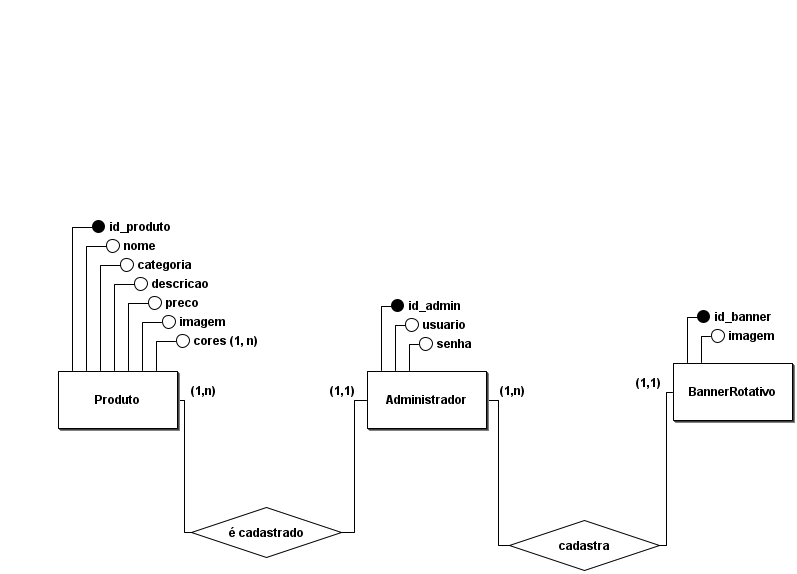
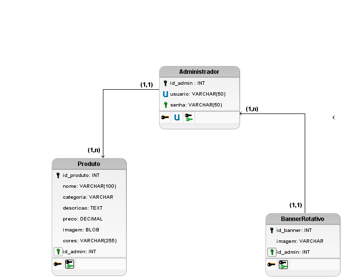

# Integrantes
Ângelo Gabriel Souza e Silva https://github.com/AngeloGSeS
Cristiane Martins Silva https://github.com/CMSILVA4
Lucas Afonso Martins Santos https://github.com/Afonso-Lucass
Maria Clara Veríssimo Ferreira Araújo https://github.com/mariaclaravfa
Matheus Ruhan Costa https://github.com/matheusruhancosta
# Título
Btex
# Descrição 
Representação da loja física digitalmente, conectando os públicos, com o mostruário dos produtos disponivéis.
# Principais Funcionalidades 
1. Mostruário de produtos, com filtros especificando categorias, e exibindo caracteristicas dos produtos, como preço e variaçoes dos produtos.
2. Login do administrador.
3. Interação direcionando as redes sociais, whatsapp e instagram.
4. Sistema para busca de produtos.
5. Exibição de informações básicas sobre a loja, como historia e localização.
6. Exibição de banner com fotos cadastradas.
7. Cadastro e alteração de produtos pelo administrador.
8. Alteração de banner rotativo.
# Link de compartilhamento do Figma
https://www.figma.com/design/VXXXR5oI063S9JuqJc76V8/Wireframes--Projeto-Final?node-id=0-1&t=klK4uGrNUjBkS28R-1
# Banco de dados
# Modelo Conceitual

A entidade "Produto" se refere aos produtos que seram exibidos no site, e ela possui os atributos "id_produto" que se refere ao atributo indentificador e que mostra o id do produto a ser cadastrado, "categoria" a qual se refere qual categoria o produto estará, "nome" o nome do produto, "descricao" uma descrição breve do produto, "preco" o preço do produto, "imagem" uma imagem figurativa do produto e por fim "cores" que são as cores disponiveis do produto, que é um atributo multivalorado. Possui o relacionamento "é cadastrado" com a entidade "Administrador" em que Produto é cadastrado por exatamente um Administrador (1,1) e um Administrador pode cadastrar um ou muitosProdutos (1,n).

A entidade "Administrador" a pessoa que gerencia o sistema e cadastra as informações, que possui os atributos "id_admin" um código único para o id do administrador, "usuario" e "senha" email do administrador e sua senha. Que se relaciona com a entidade "BannerRotativo" com o relacionamento "cadastra" em que BannerRotativo é cadastrado por exatamente um Administrador (1,1) e um Administrador pode cadastrar um ou muitos Banners (1,n).

A entidade "BannerRotativo" são os slides de propaganda que aparecem no site e guarda um código único "id_banner" e as imagens do banner "imagem".

# Modelo Lógico 

# Modelo Fisíco

